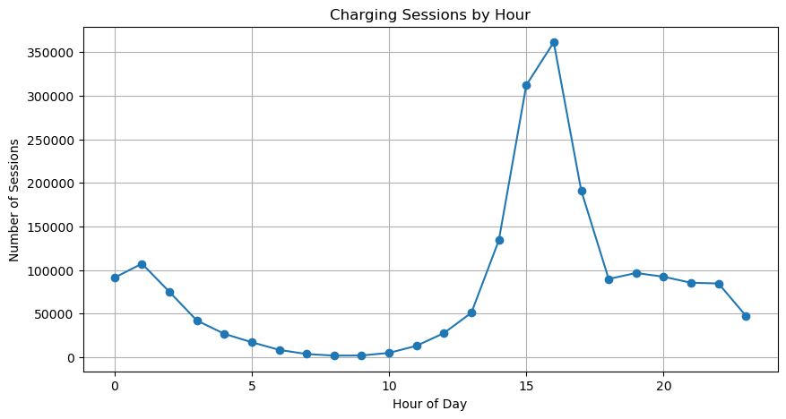
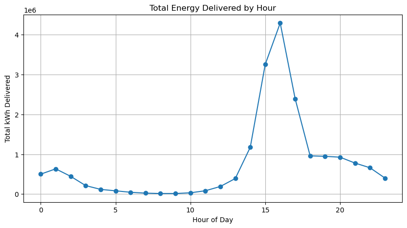
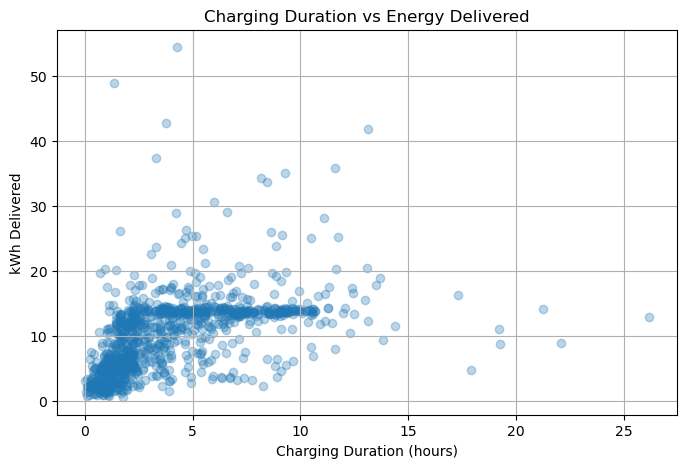

## EV Charging Behavior Analysis

Understanding peak demand, energy consumption patterns, and charging inefficiencies using SQL and Python.

## Overview

This project analyzes EV charging session data to uncover:

- When charging demand is highest  
- How energy usage varies throughout the day  
- Whether charging sessions are efficient  
- How user behavior impacts charger availability  

The goal is to move beyond basic analysis and identify real-world operational and product opportunities** in EV charging infrastructure.

## Key Questions

1. When is EV charging demand highest?
2. Do peak usage hours also correspond to peak energy demand?
3. Are longer charging sessions always more productive?
4. Do users remain connected after meaningful charging is complete?

## Tools & Technologies

- SQL (SQLite)   
- Python
- Pandas
- Matplotlib
- Jupyter Notebook  

## Dataset

This project uses the "Electric Vehicle Charging Dataset" dataset available on Kaggle.

Source : https://www.kaggle.com/datasets/mexwell/electric-vehicle-charging-dataset

## Key Insights

### 1. Peak Charging Demand

Charging sessions are highly concentrated between 3 PM and 5 PM, with a peak at 4 PM.
This suggests strong alignment with daily routines 

### 2. Peak Energy Demand Aligns with Peak Usage

Total energy consumption also peaks at 4 PM, indicating peak hours are not just busy but excess energy is being used. This creates maximum stress on charging stations.

### 3. Charging Inefficiency

Some sessions show long durations (6–25+ hours) but very low energy delivered.

This indicates charger occupancy without active charging

### 4. Energy Plateau Effect

Many sessions deliver roughly 10–15 kWh, even as duration increases significantly.

That means that even after charging completes early, the Uusers remain connected afterward.  

## Key Problems Identified

- Peak-hour congestion (3–5 PM)
- High simultaneous energy demand
- Inefficient charger utilization
- Idle occupancy after charging completion

## Visualizations

### Charging Sessions by Hour

### Total Energy Delivered by Hour

### Charging Duration vs Energy Delivered

